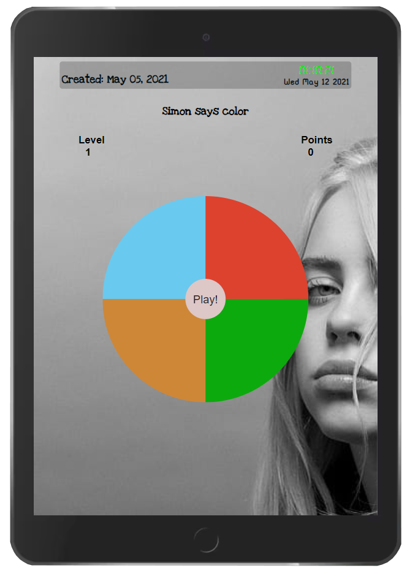
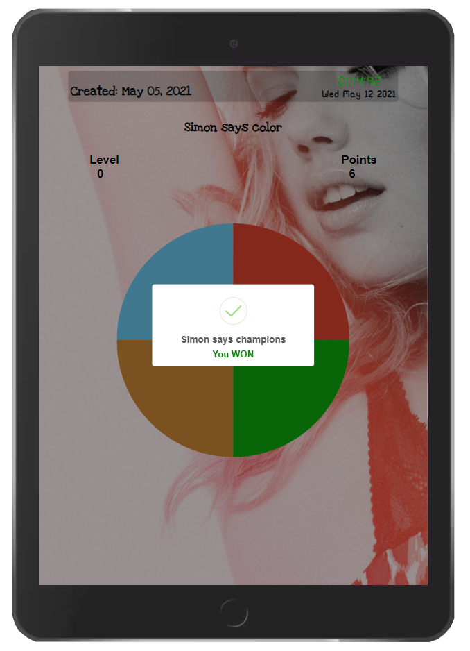

# Game Simon says
 Una previa visualizacion del juego shown in this gif, for cell phones, tablets and desktop.

  

### About the game.
Simon says is a game to play between three o more people, donde uno de los participantes es "Simon" who directs the action. Los demas deben hacer lo que simon dice. The trick is in the magic phrase "Simon says". Sí dice "Simon manos arriba" los jugadores deben levantar la mano or they are eliminated. This physical verision.

The algorithm behind this game is artificial intelligence (AI), donde cada paleta de color se ilumina, y debes clickear ese color para no perder la secuencia or else, 👾 pierdes o 🤖 ganas. Solo memoriza el orden que se iluminan la paleta de colores y repite el orden. Beats the levels. I see you on the other side, champions.

### Go to the Game.
right [here](https://brunomaldonado.github.io/Simon-says/ "here")

------------

> Creator: Bruno Maldonado Rigoberto
