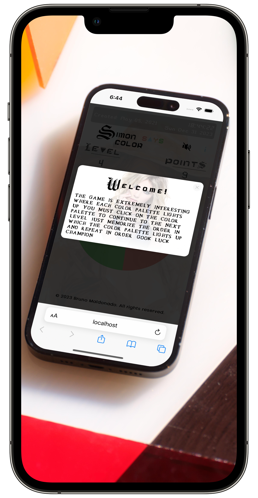
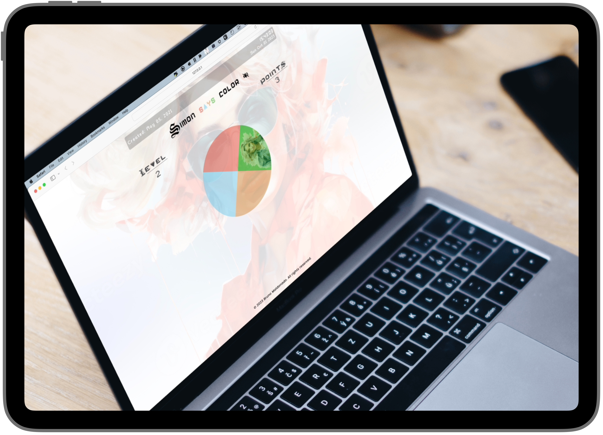

# Game, Simon says
---
### About the game.

Simon says is a game involving three or more people, where one of the participants is "Simon" who directs the action. The others must do what Simon says. 

<table>
  <tr>
    <!-- <td valign="top"></td> -->
    <!-- <td valign="top"></td> -->
    <td valign="top"></td>
    <td valign="top"></td>
  </tr>
</table>

The algorithm of this game is extremely interesting, where each color palette lights up, you must click on the color palette to continue to the next level. Just memorize the order in which the color palette lights up and repeat in order. Gook luck champion... 

### Go to the Game.

right [here](https://brunomaldonado.github.io/Simon-says/ "here")

---

> Creator: Bruno Maldonado Rigoberto
